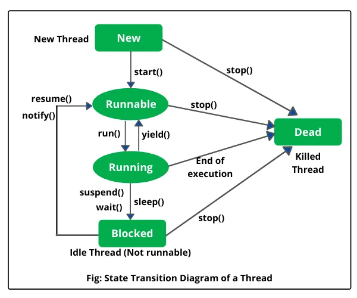

thread life circle 
NEW
    thread - створений але не запушєний
    A thread is created but not yet started.
RUNNABLE
    thread - запушєний
    The thread is executing in the JVM or waiting for OS resources.
BLOCKED
    thread тимчасово неактивний поки читає на lock
    спрацьовує коли
    The thread is temporarily inactive while waiting for a lock.
WAITING
    thread чекає інший thread поки він закінчить роботу 
    спрацьовує коли викликаємо ці методи
    object.wait()
    thread.join() or
    LockSupport.park()
(The thread waits indefinitely for another thread to perform a specific action)
TIMED_WAITING
    thread сам себе зупиняє 
    (The thread pauses itself for a strictly specified period.)
TERMINATED
    The thread has completely finished its execution.
